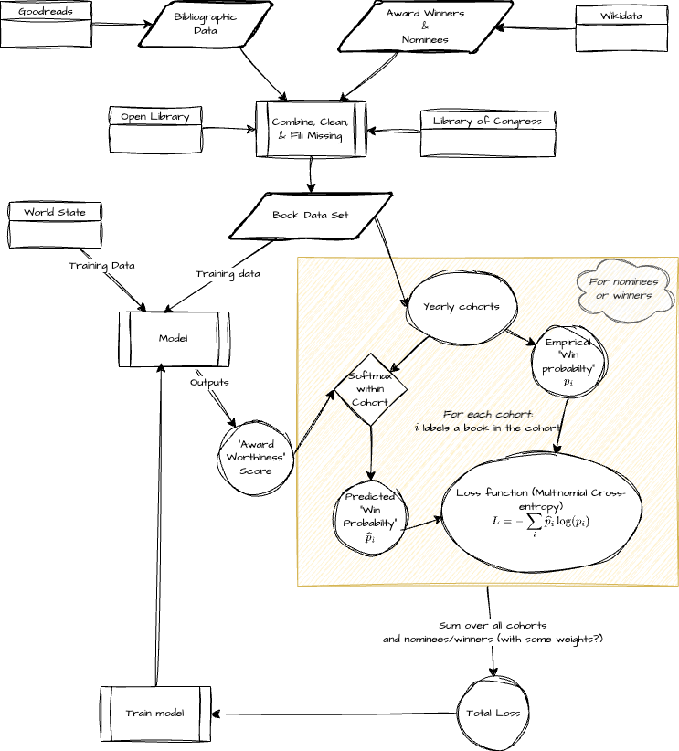

# Predicting Scifi and Fantasy Award Winners

## Data Files

### Raw Files

Located in `data/raw/`:

**These are not included in the repo, they are generated when the snakemake
workflow is run**

- `award_novels.json`: Downloaded from Wikidata using SPARQL query, contains
  information about novels nominated for major science fiction and fantasy
  awards, including:
  - Title, author, and publication year
  - Award nominations and wins
  - OpenLibrary and ISBN identifiers
  - Publication dates and language information
  - **NB** This includes only books nominated for one of the major scifi/fantasy
    wards in the best novel category (see
    [](scripts/queries/wikidata_awards.sparql) for which awards are included)

- `awards_all.json`: Downloaded from Wikidata, contains comprehensive award
  information including:
  - All winners and nominees across multiple award categories
  - Award dates and categories
  - Author information
  - Covers major awards like Hugo, Nebula, World Fantasy, and more
  - **NB** This includes _winners_ in _any_ category and for a broader set of
    awards (see [](scripts/queries/wikidata_winners.sparql))

- `nominee_biographical.json`: Downloaded from Wikidata, contains biographical
  information about award nominees:
  - Author names and Wikidata IDs
  - Gender information
  - Date of birth
  - Birth country
  - Residence information

### Processed Files

Located in `data/`:

- `nominated_novels.csv`: Processed data from `award_novels.json`, containing:
  - Cleaned and normalized award nomination data
  - Counts of nominations and wins per work
  - Matched identifiers for cross-referencing
  - Publication information

- `cumulative_awards.csv`: Generated from `awards_all.json`, contains:
  - Running total of awards per author as of year
  - Example: As of the end of `2023`, `Ann Leckie` had won awards listed as
    major awards on sfadb `14` times.

## Development Setup

### Prerequisites

- [pixi](pixi.sh) for Python environment management

### Getting Started

1. **Install pixi**

   On macOS you can use [Homebrew](brew.sh):
   ```sh
   brew install pixi
   ```
   but other ways of installing are given on the [pixi website](pixi.sh).

2. **Clone and Setup**
   ```sh
   git clone <repository-url>
   cd scifi-fantasy
   pixi install
   ```

3. **Run the Pipeline**
   ```sh
   # Run with a single core
   pixi run snakemake --cores 1

   # Or use multiple cores for faster processing
   pixi run snakemake --cores 4
   ```

### Development Workflow

1. **Environment Management**
   - All dependencies are managed through pixi
   - Add new dependencies with `pixi add`
   - Run `pixi install` after updating dependencies

2. **Data Processing**
   - Raw downloads of data go in `data/raw/`
   - Output files are in the `data/`

3. **Adding New Data Processing steps**
   - Add new rules to `Snakefile`
   - Place scripts in `scripts/` directory
   - Place sql or sparql queries in `scripts/queries`

## Data Processing Pipeline

The data processing pipeline uses Snakemake to orchestrate the following steps:

### 1. Data Download

- **Awards Data**: Fetches award information from Wikidata using SPARQL queries
  <https://query.wikidata.org>, including:
  - Award nominations and winners
  - Author biographical information
  - Publication metadata
  - Cross-referenced identifiers (ISBN, OpenLibrary)

### 2. Data Processing

The pipeline processes the raw Wikidata data to:

- Clean and normalize award information
- Match award entries with author data
- Generate cumulative award statistics
- Create analysis-ready datasets

### 3. Output Files

The pipeline produces several key datasets:

- `data/nominated_novels.csv`: Cleaned award nomination data with author
  information
- `data/cumulative_awards.csv`: Running totals of awards per author over time

## Project Brainstorming

The basic idea is to try break data into years and train a ranking model on each
year's shortlist of nominated or candidate books.

Schematically the idea can be depicted like the following



### Potential Features

- Bibliographic data
- Publisher information
- Author information
- World events/trends for the award year
- Proxies for sales information

## Model Training Process for Predicting Award-Winning Books

The model training pipeline for predicting book award winners involves the
following key stages:

### 1. **Data Ingestion**

Multiple sources contribute data:

- **Goodreads**, **Open Library**, **Library of Congress**, **Bibliographic
  Data**, and **Wikidata** provide rich metadata on books.
- **Award Winners & Nominees** supplies ground truth labels for supervised
  learning.
- **World State** adds contextual information relevant to the publication year
  (e.g., cultural or industry trends).

### 2. **Data Preparation**

All inputs are passed through a **Combine, Clean, & Fill Missing** step to
create a unified and complete **Book Data Set**. This step resolves
inconsistencies, integrates fields, and imputes missing values where necessary.

### 3. **Cohort Definition**

Books are grouped into **Yearly Shortlist Cohorts**, representing the set of
nominated or candidate works for each award and year. This framing allows the
model to compare books within each shortlist for winner selection.

### 4. **Modeling Process**

- Each book in a shortlist cohort is assigned an **"Award Worthiness" Score** by
  the model.
- These scores are used to compute probabilities for winning the award within
  the shortlist.
- The model assumes a fixed number of winners per award per year.

### 5. **Loss Computation**

A **Multinomial Cross-Entropy Loss Function** is computed for winner selection:

$$L_{win} = -\sum_i \frac{N_i}{N_\text{win}} \log(\hat{p}_i)$$

where $N_i$ is the observed win count for book $i$, $N_\text{win}$ is the total
number of winners for that cohort, and $\hat{p}_i$ is the predicted probability
of winning. This loss measures the divergence between the observed winner
distribution and the model's predicted probabilities, respecting the fixed
number of winners per shortlist.

#### Derivation of Scaled Cross-Entropy Loss for Winner Selection

Consider a shortlist cohort of $k$ books with:

- Total winners $N_{\mathrm{win}}$.
- For each book $i$: observed win count $N_i$; predicted probability $\hat p_i$.

i. **Multinomial PMF for wins**\
Model the allocation of exactly $N_{\mathrm{win}}$ win slots among the $k$
books: 

$$P(\{N_i\})
     = \frac{N_{\mathrm{win}}!}{\prod_{i=1}^k N_i!}\;\prod_{i=1}^k \hat p_i^{\,N_i}.$$

This gives the likelihood of observing each book's win count.

ii. **Negative log-likelihood**\
Transform products into sums: 

$$ -\ln P
     = -\ln(N_{\mathrm{win}}!) \;+\; \sum_{i=1}^k \ln(N_i!) \;-\; \sum_{i=1}^k N_i\,\ln(\hat p_i).$$

The first two terms are constant w.r.t.\ the model.

iii. **Normalize by total winners**\
Divide by $N_{\mathrm{win}}$ to put different years on the same scale: 

$$  L_{\mathrm{win}}
     = -\frac{1}{N_{\mathrm{win}}}\sum_{i=1}^k N_i\,\ln(\hat p_i)
     = -\sum_{i=1}^k \frac{N_i}{N_{\mathrm{win}}}\,\ln(\hat p_i).$$

Here $\frac{N_i}{N_{\mathrm{win}}}$ is the empirical win distribution over the
shortlist cohort.

iv. **Interpretation**

- **Normalization** by $N_{\mathrm{win}}$ ensures comparability across years.
- **Minimizing** this loss aligns the model's predicted distribution
  $\{\hat p_i\}$ with the empirical distribution $\{N_i/N_{\mathrm{win}}\}$,
  giving more weight to books with more wins.

### 6. **Total Loss Aggregation**

Losses are aggregated **across all shortlist cohorts**, potentially with
weighted contributions based on the significance of awards, to compute the
**Total Loss**.

### 7. **Model Training**

The **Total Loss** guides gradient-based optimization to train the model
parameters.
