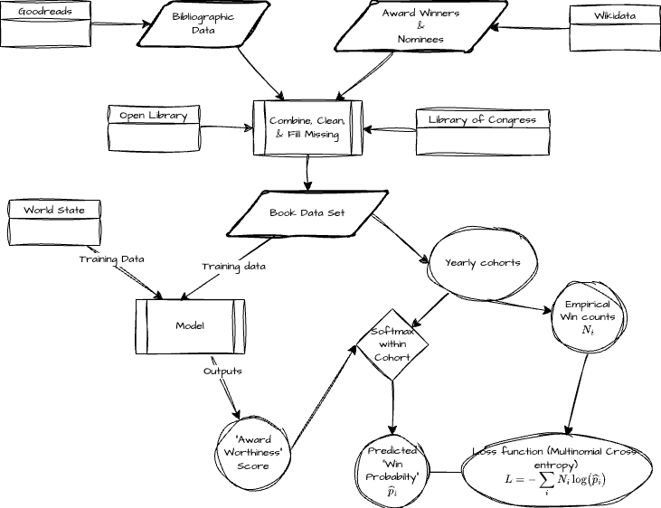

# Project Overview and Approach

## Project Concept

The basic idea is to try break data into years and train a ranking model on each
year's shortlist of nominated or candidate books.

Schematically the idea can be depicted like the following:

## Potential Features

Our model will consider multiple types of features to predict award worthiness:

- **Bibliographic data**: Publication details, length, genre classifications
- **Publisher information**: Publisher prestige, market position, historical
  award success
- **Author information**: Demographics, previous awards, career trajectory
- **World events/trends for the award year**: Cultural context, social
  movements, industry trends
- **Proxies for sales information**: Where available, commercial success
  indicators

## Data Sources

The model training pipeline ingests data from multiple sources:

- **Wikidata**: Provides award nominations and winners, author biographical
  information, and publication metadata
- **OpenLibrary**: Supplies book descriptions and additional metadata
- **Wikipedia**: Offers book descriptions and contextual information
- **Google Books API**: Provides book descriptions and additional metadata

## Approach Summary

1. **Cohort-Based Modeling**: Books are grouped into yearly shortlist cohorts
   representing the set of nominated or candidate works for each award and year
2. **Award Worthiness Scoring**: Each book receives a score that can be used to
   compute probabilities for winning within its cohort
3. **Fixed Winner Assumption**: The model assumes a fixed number of winners per
   award per year, making this a ranking problem within each cohort
4. **Multi-Year Training**: The model learns patterns across multiple years of
   award data to generalize to new cohorts
